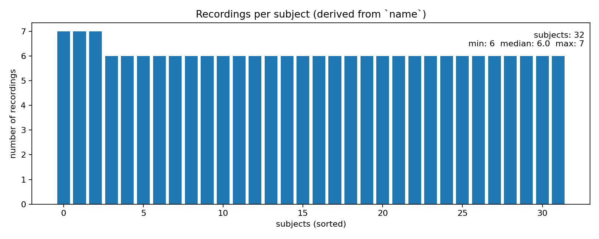
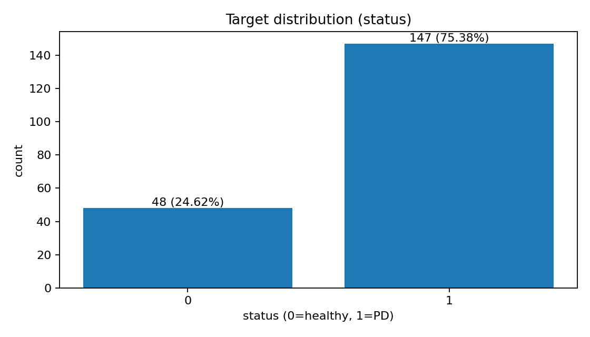
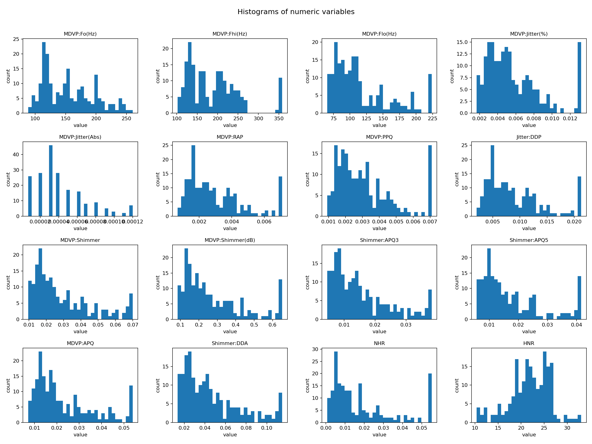
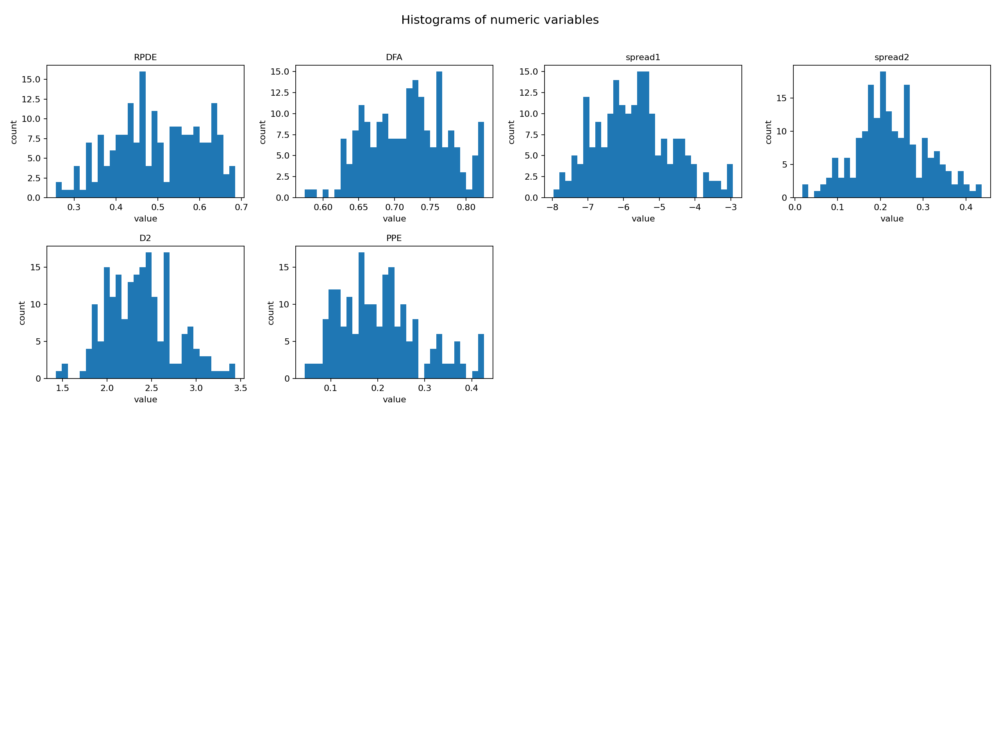
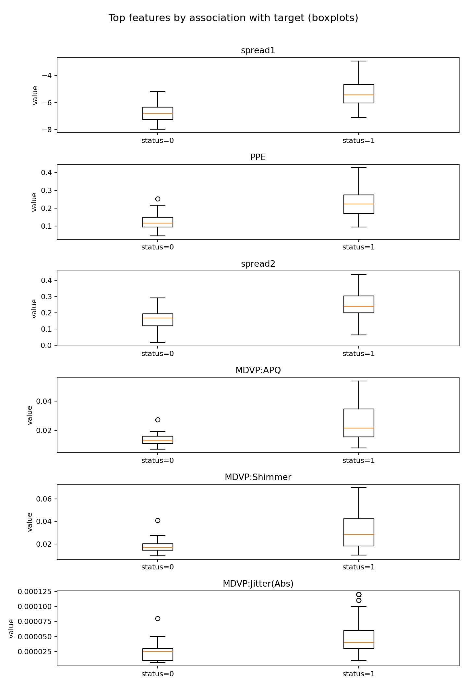
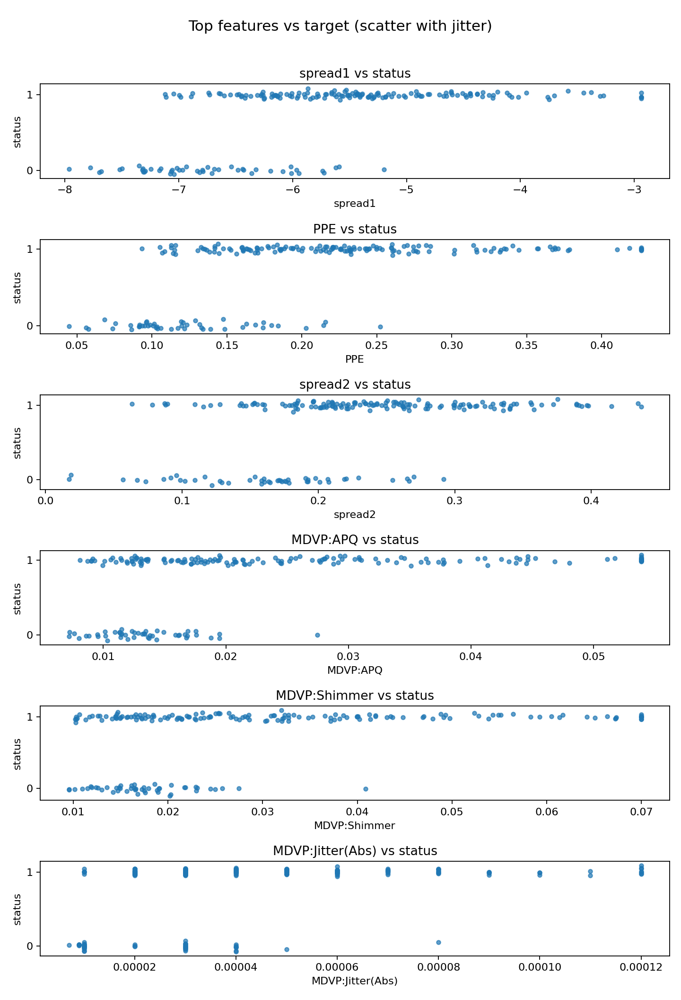
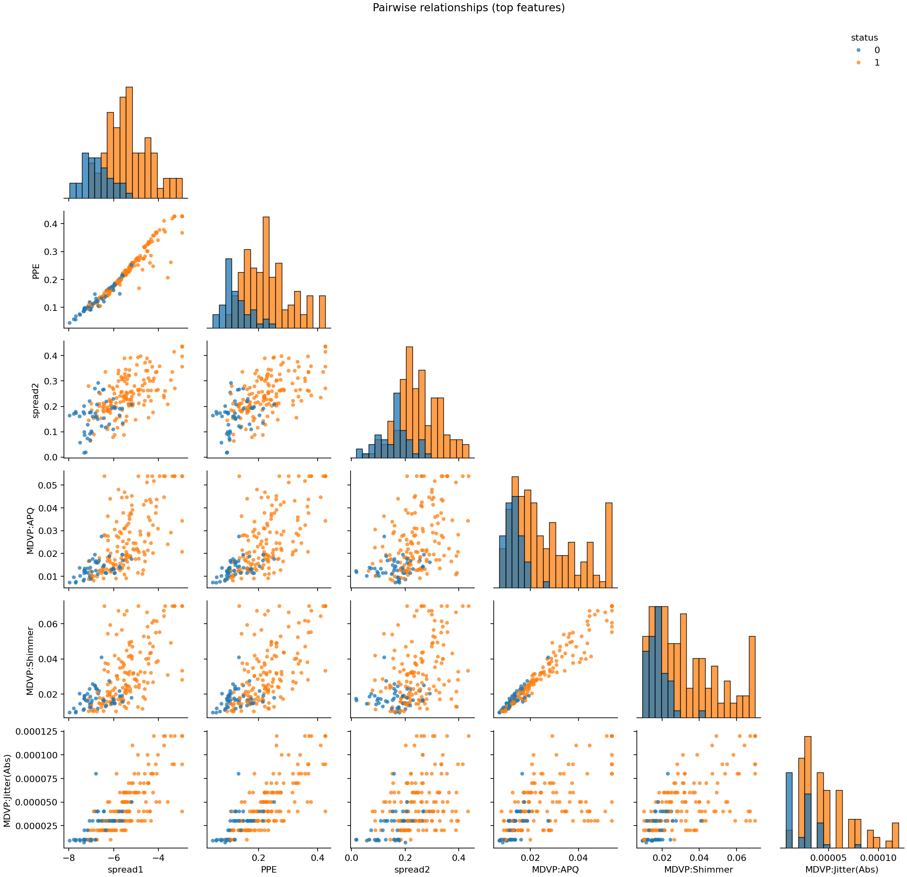
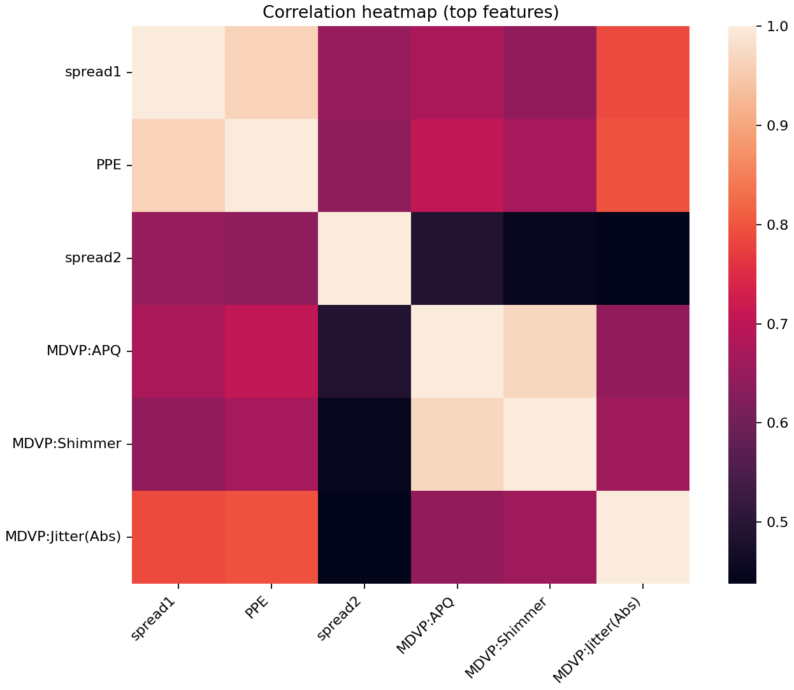

# Parkinson’s Voice Dataset  
Reproducible EDA and Classification Pipeline

This repository contains a compact, reproducible pipeline for exploratory data analysis and baseline modeling on the **Oxford Parkinson’s Disease Detection Dataset**. The dataset consists of biomedical voice measurements extracted from speech recordings and is widely used as a benchmark for Parkinson’s disease detection from voice features.

The project is implemented as a sequence of standalone stages. Each stage is runnable from the command line and produces a clear artifact such as a cleaned dataset, a report, or a set of figures. The goal is to keep the analysis transparent, repeatable, and suitable for academic reporting.

---

## Dataset overview

The data includes voice measurements derived from sustained vowel phonations. Each row corresponds to **one recording**. Many subjects contribute **multiple recordings**, which is important for correct evaluation because splitting data randomly by rows can lead to subject leakage.

### Columns and roles

- **Identifier:** `name`  
  A nominal identifier that encodes the subject and the recording index.
- **Target:** `status`  
  A binary label where `0` indicates a healthy control and `1` indicates Parkinson’s disease.
- **Features:** 22 numeric variables  
  All predictors are quantitative and represent acoustic and nonlinear signal measures.

### Practical implication for evaluation

Because there are multiple recordings per subject, model evaluation should use **group-aware splitting by subject**, rather than naive row-wise random splitting. This prevents leakage, where recordings from the same person appear in both training and test sets.

---

## Project structure

The pipeline is organized as **numbered stages**:

- `0_data_profile.py`  
- `1_missing_values.py`  
- `2_types_and_stats.py`  
- `3_feature_audit_outliers_corr.py`  
- `4_visualize_data.py`

Each stage reads an input dataset, applies a clearly defined transformation or analysis step, and writes outputs to disk.

---

## Environment setup

Create and activate a virtual environment and install dependencies.

```bash
python -m venv .venv
# Windows
.venv\Scripts\activate
# macOS / Linux
source .venv/bin/activate

pip install -r requirements.txt
````

If you want the pairwise plots and heatmaps in Stage 4, make sure seaborn is installed.

```bash
pip install seaborn
```

---

## Stage 0

Dataset profiling and feature typing

This stage provides a structured overview of the dataset, including shape, column roles, and feature types.

### Run

```bash
python 0_data_profile.py --input dataset/parkinsons.data
```

### Findings

* The dataset contains **195 rows** and **24 columns**
* The identifier column `name` is nominal and uniquely identifies recordings
* The target column `status` is binary and nominal
* All 22 predictors are **quantitative numeric features**
* The dataset contains **no missing values** in this source version

This stage confirms that the dataset is already in a machine learning friendly form. The only non-numeric column is the identifier, which should not be used as a predictor.

---

## Stage 1

Missing value audit and robust handling policy

This stage audits missingness and applies a consistent handling strategy designed for robustness across dataset variants.

### Run

```bash
python 1_missing_values.py --input dataset/parkinsons.data --output dataset/parkinsons_clean.csv
```

### Findings

* Missing cells: **0**
* Missingness relative to row count: **0.000000%**
* No columns contain missing values

Even when missingness is absent, the pipeline keeps a clear policy for biomedical datasets:

* Missing identifier or target values require dropping affected rows
  Identity and labels cannot be imputed safely.
* Missing numeric features are filled using median imputation
  Median is robust to outliers and appropriate for skewed biomedical measurements.
* Missing categorical features are filled using the most frequent value
  This is a standard baseline for nominal variables.

The output `dataset/parkinsons_clean.csv` serves as a stable input for later stages.

---

## Stage 2

Type validation and descriptive statistics

This stage ensures that data types match analytical expectations and computes descriptive statistics for all variables.

### Run

```bash
python 2_types_and_stats.py --input dataset/parkinsons_clean.csv --output dataset/parkinsons_typed.csv
```

### Findings

The identifier column is normalized to a stable string dtype, and the target is validated and retained as an integer binary label.

The class distribution shows a pronounced imbalance:

* Healthy control: **48 recordings**
* Parkinson’s disease: **147 recordings**

This imbalance is important for downstream modeling. Accuracy alone is not a reliable metric, and later evaluation should include metrics such as ROC AUC, PR AUC, and balanced accuracy.

The stage also computes standard descriptive statistics for all numeric features, including mean, standard deviation, quartiles, and extrema. Many variables exhibit long-tailed behavior, which is typical for acoustic measurements and motivates robust preprocessing choices.

---

## Stage 3

Feature inspection, outlier treatment, and correlation analysis

This stage inspects feature ranges, detects domain inconsistencies, applies outlier treatment, and computes the correlation matrix for numeric variables.

### Run

```bash
python 3_feature_audit_outliers_corr.py --input dataset/parkinsons_typed.csv --output dataset/parkinsons_stage3.csv --corr-output reports/corr_stage3.csv
```

### Feature ranges

All 22 predictors are numeric, and their values fall in plausible ranges for this dataset. One feature, `spread1`, naturally takes negative values by definition, so negative values in this column are not an error.

### Error and outlier definition

Two distinct concepts are used:

**Domain violations**
Values that violate conservative domain assumptions such as negative frequencies or probability-like measures outside the interval from 0 to 1. These are treated as invalid values and would be replaced using median imputation after marking them as missing.

**Statistical outliers**
Values outside the Tukey fences computed with the IQR rule using multiplier 1.5. These are treated with winsorization, meaning they are clipped to the nearest fence. This approach preserves dataset size, which matters for small datasets.

### Findings

* Domain violations detected: **none**
* IQR outliers detected: **173 individual cells**
* Winsorized values: **173**
* Median imputation was not required because no invalid or missing values remained

The cleaned dataset is written to `dataset/parkinsons_stage3.csv`.

### Correlation structure

The correlation matrix confirms substantial redundancy among several feature families. Some pairs are effectively duplicates:

* `MDVP:RAP` and `Jitter:DDP` are perfectly correlated
* Several shimmer-based features are near-duplicates

This suggests that baseline models may benefit from regularization and that multicollinearity should be considered when interpreting coefficients in linear models.

---

## Stage 4

Visualization and qualitative interpretation

This stage produces publication quality plots that describe distributional shape, class imbalance, subject structure, feature-target relationships, and feature redundancy.

### Run

```bash
python 4_visualize_data.py --input dataset/parkinsons_stage3.csv --output-dir reports/stage4_figures
```

### Figures produced

All figures are saved under `reports/stage4_figures`.

#### Recordings per subject

This plot shows how many recordings are available per derived subject identifier. The distribution is tightly concentrated, with most subjects contributing six recordings and a small number contributing seven. This supports the use of group-aware evaluation strategies.



#### Target distribution

The dataset is strongly imbalanced toward the Parkinson’s class. This motivates careful metric selection and group-aware validation.



#### Histograms of numeric features

The feature distributions show a mix of approximately unimodal variables and clearly skewed variables. Skewness and heavy tails are common in biomedical signal-derived features and justify robust preprocessing such as winsorization and scaling.




#### Feature separation by class

The boxplots highlight features that show clear distributional shifts between healthy controls and Parkinson’s recordings. In particular, features such as `PPE`, `spread1`, and `spread2` show noticeable separation, suggesting they carry substantial discriminative signal.



#### Feature values versus target

These scatterplots show the same relationships with explicit visibility of overlap and outliers. They reinforce that several features exhibit measurable shifts between classes, while still leaving room for overlap, which is expected in real biomedical data.



#### Pairwise relationships among informative features

The pairwise plot provides a compact view of both feature-feature relationships and class separation in a low-dimensional projection. It also makes redundancy visible: some feature pairs align along near-linear trends, indicating strong collinearity.



#### Correlation heatmap for the same subset

The heatmap summarizes the correlation structure for the selected top features and confirms that some variables are strongly correlated. This supports later use of regularization or feature selection to stabilize models and reduce redundancy.



### Summary interpretation

The dataset provides strong evidence of signal relevant to Parkinson’s detection, with several features showing clear distributional shifts. At the same time, the dataset has three properties that shape modeling choices:

* Significant class imbalance toward Parkinson’s recordings
* Multiple recordings per subject that require group-aware validation
* High redundancy among feature families such as jitter and shimmer measures

A principled baseline model should therefore use group-aware splitting, robust metrics, and some mechanism to manage redundancy, such as regularization.

---

## How to run the full pipeline so far

```bash
python 0_data_profile.py --input dataset/parkinsons.data
python 1_missing_values.py --input dataset/parkinsons.data --output dataset/parkinsons_clean.csv
python 2_types_and_stats.py --input dataset/parkinsons_clean.csv --output dataset/parkinsons_typed.csv
python 3_feature_audit_outliers_corr.py --input dataset/parkinsons_typed.csv --output dataset/parkinsons_stage3.csv --corr-output reports/corr_stage3.csv
python 4_visualize_data.py --input dataset/parkinsons_stage3.csv --output-dir reports/stage4_figures
```

---

## Next steps

The next stage of the project is baseline classification with correct validation. A strong academic baseline should include:

* Subject-based splitting using GroupKFold or GroupShuffleSplit
* Standardization and robust preprocessing
* Baseline models such as logistic regression with regularization and tree-based methods
* Evaluation with ROC AUC, PR AUC, balanced accuracy, and confidence intervals where appropriate


